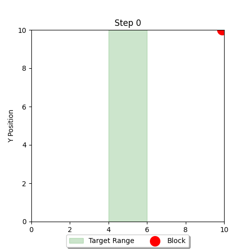

# Proximal-Policy-Optimization2
Proximal Policy Optimization Algorithm

# 问题描述
假设有一个二维的环境，左边界𝑥_𝑙𝑒𝑓𝑡=0，右边界𝑥_right=10，高度ℎ=10。地面位置(ℎ=0)分为安全区域和危险区域，安全位置的左边界𝑙𝑒𝑓𝑡=4，右边界𝑟𝑖𝑔ℎ𝑡=6，其余均为危险区域。

有一个智能体方块，从指定高度(ℎ=10)的某个随机水平位置开始，每次下降一个单位，下降过程中智能体每次只有两种选择，向左或者向右移动一个单位。下降过程不能越界，但仍可继续决策。最终目标是落在安全区域。

<div align="center">
  
</div>

状态空间：方块的水平和竖直坐标(𝑥, 𝑦)，有无数种可能状态。

动作空间：向左移动一个单位，或向右移动一个单位。

策略网络（Actor）：采用三层MLP网络，输入归一化后的水平和竖直坐标，网络输出决策概率，是一个二维的向量。

状态价值网络（Critic）：采用三层MLP网络，输入归一化后的水平和竖直坐标，网络输出状态价值，是一个一维的标量。

奖励机制：分为过程奖励和结果奖励。过程奖励：奖励初始化为0，如果此时水平位置在(4.0, 6.0)内，则奖励加0.2，否则减0.1；将水平位置和5.0（目标区域的中心）的绝对值视为距离，奖励值减去0.05倍的距离；最后引入时间惩罚，奖励值减去0.1，促使智能体尽可能在较短的步骤内实现预期目标。结果奖励：如果水平位置在(4.0, 6.0)内，则奖励为10.0；否则为-10.0 。


# 代码运行

这里PPO算法采用的是标准的Actor-Critic框架。主要介绍三种实现方式：蒙特卡洛方法、时序差分方法、广义优势估计方法。

采用基于蒙特卡洛方法的PPO算法，运行方式如下：

```bash
python train_MC.py
```

采用基于时序差分方法的PPO算法，运行方式如下：

```bash
python train_TD.py
```

采用基于广义优势估计方法的PPO算法，运行方式如下：
```bash
python train_TD.py
```


# 实验结果

假设每个update采样10条轨迹（总共有2500个update），在每个update过程中进行4次参数更新（即总共更新参数10000次），训练效率大幅提升。

采用基于蒙特卡洛方法的PPO算法，实验结果如下：
```bash
    Initial Evaluation Safe Rate: 0.1484
    Update 10, Success Rate: 0.882
    Update 20, Success Rate: 0.514
    Update 30, Success Rate: 0.613
    Update 40, Success Rate: 0.614
    Update 50, Success Rate: 0.988
    Update 60, Success Rate: 0.803
    Update 70, Success Rate: 0.977
    Update 80, Success Rate: 0.979
    Update 90, Success Rate: 0.962
    Update 100, Success Rate: 0.895
    ......
    Update 2400, Success Rate: 0.991
    Update 2410, Success Rate: 0.997
    Update 2420, Success Rate: 0.992
    Update 2430, Success Rate: 0.946
    Update 2440, Success Rate: 0.970
    Update 2450, Success Rate: 0.968
    Update 2460, Success Rate: 0.998
    Update 2470, Success Rate: 0.937
    Update 2480, Success Rate: 0.987
    Update 2490, Success Rate: 0.963
    Update 2500, Success Rate: 0.971
    Final Evaluation Safe Rate: 0.9828
```

采用基于时序差分方法的PPO算法，实验结果如下：
```bash
    Initial Evaluation Safe Rate: 0.1484
    Update 10, Success Rate: 0.000
    Update 20, Success Rate: 0.874
    Update 30, Success Rate: 0.791
    Update 40, Success Rate: 0.939
    Update 50, Success Rate: 0.958
    Update 60, Success Rate: 0.896
    Update 70, Success Rate: 0.917
    Update 80, Success Rate: 0.999
    Update 90, Success Rate: 0.917
    Update 100, Success Rate: 0.982
    ......
    Update 2400, Success Rate: 0.996
    Update 2410, Success Rate: 0.997
    Update 2420, Success Rate: 0.978
    Update 2430, Success Rate: 0.971
    Update 2440, Success Rate: 0.990
    Update 2450, Success Rate: 0.981
    Update 2460, Success Rate: 0.998
    Update 2470, Success Rate: 1.000
    Update 2480, Success Rate: 0.990
    Update 2490, Success Rate: 0.997
    Update 2500, Success Rate: 0.975
    Final Evaluation Safe Rate: 0.9887
```

采用基于广义优势估计方法的PPO算法，实验结果如下：
```bash
    Initial Evaluation Safe Rate: 0.1484
    Update 10, Safe Rate: 0.1250
    Update 20, Safe Rate: 0.5890
    Update 30, Safe Rate: 0.8230
    Update 40, Safe Rate: 0.7480
    Update 50, Safe Rate: 0.9200
    Update 60, Safe Rate: 0.9170
    Update 70, Safe Rate: 0.9970
    Update 80, Safe Rate: 0.9510
    Update 90, Safe Rate: 0.9680
    Update 100, Safe Rate: 0.9930
    ......
    Update 2400, Safe Rate: 0.9950
    Update 2410, Safe Rate: 0.9800
    Update 2420, Safe Rate: 0.9860
    Update 2430, Safe Rate: 0.9990
    Update 2440, Safe Rate: 0.9930
    Update 2450, Safe Rate: 0.9800
    Update 2460, Safe Rate: 0.9780
    Update 2470, Safe Rate: 0.9870
    Update 2480, Safe Rate: 0.9890
    Update 2490, Safe Rate: 0.9480
    Update 2500, Safe Rate: 0.9660
    Final Evaluation Safe Rate: 0.9855
```
